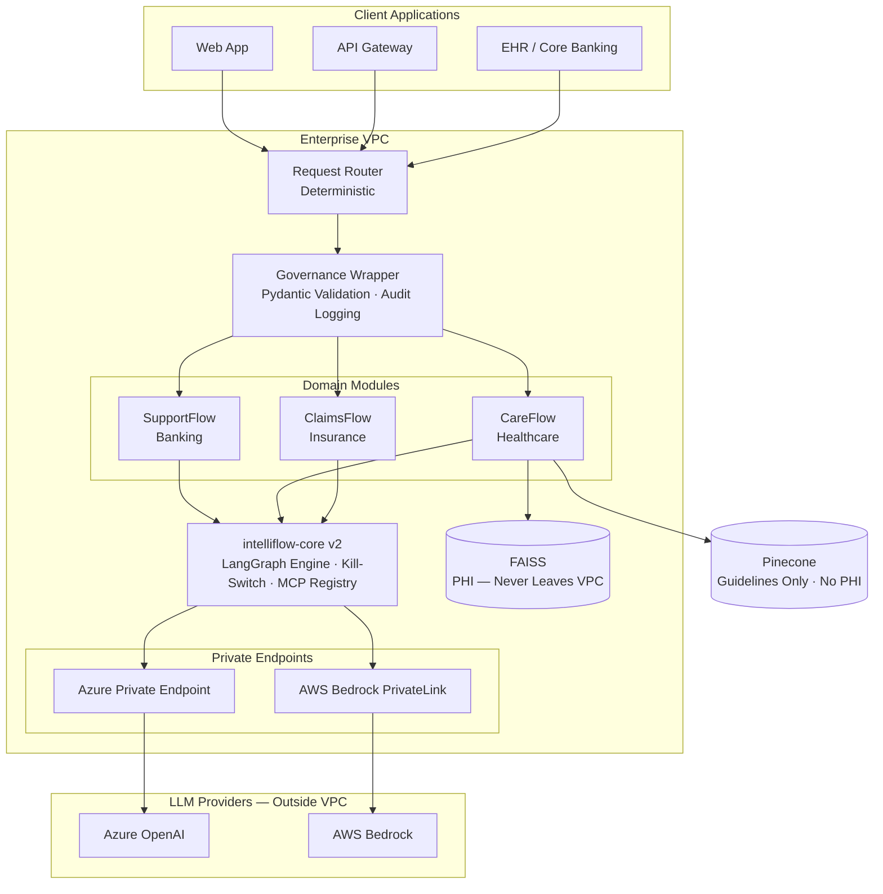
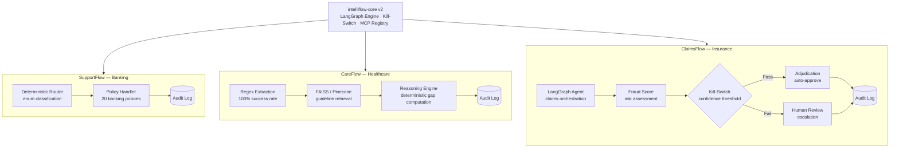
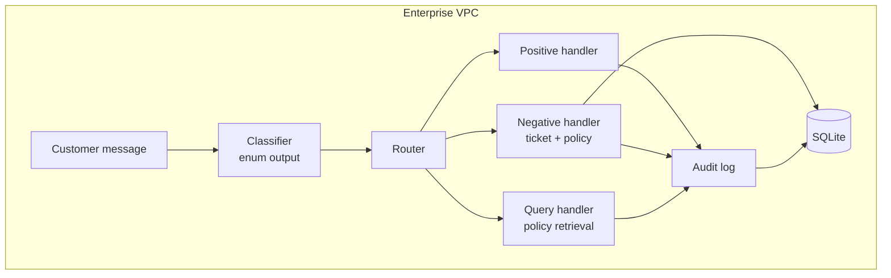
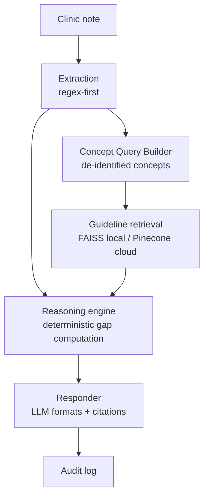
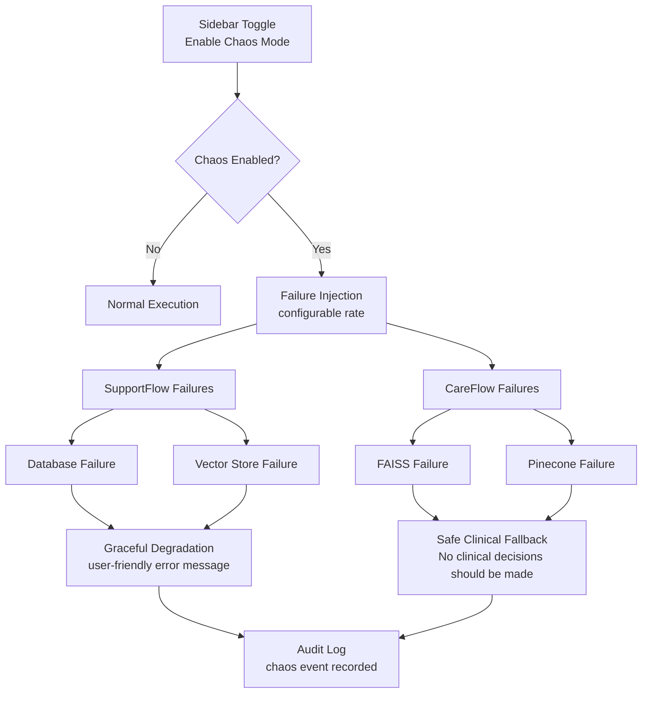

# IntelliFlow OS — Architecture

## Platform Overview

## Module Flow

## SupportFlow Flow

## CareFlow Flow (Governed Deterministic Reasoning)

## Chaos Mode Control Flow

## Developer Tools Layer

## Notes
- Enterprise integration middleware optimized for auditability and regulatory compliance.
- Deterministic logic is used where correctness matters.
- LLM translates and formats; code decides.
- Designed for Azure OpenAI Service (BAA-eligible) to meet enterprise compliance requirements for regulated industries.
