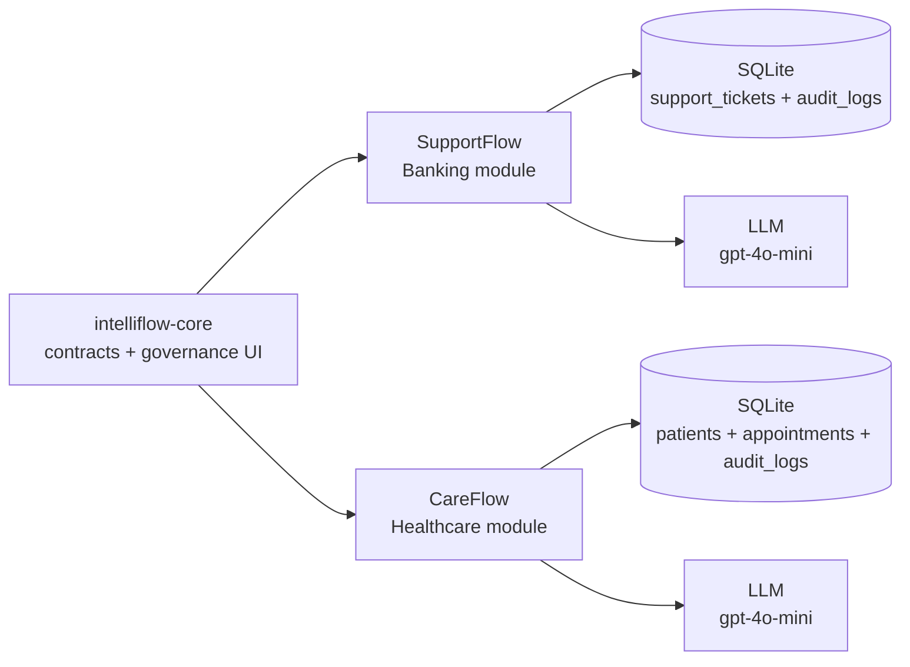
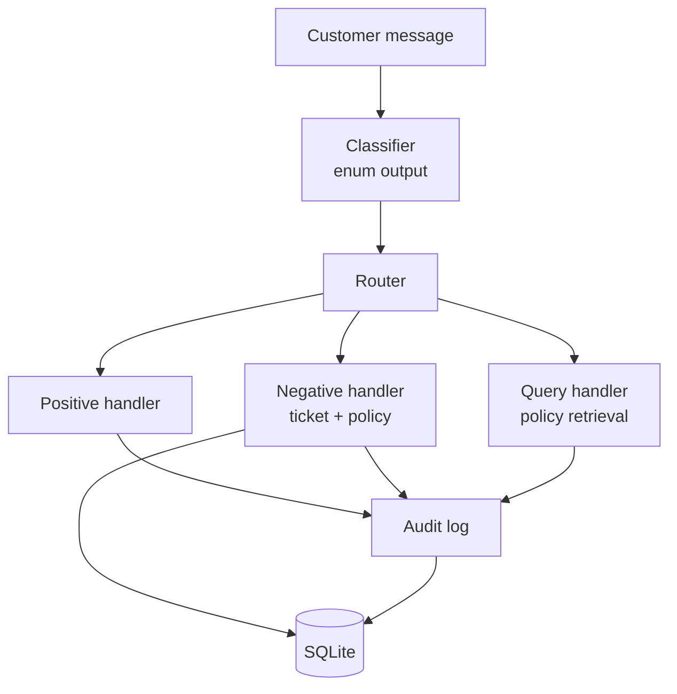
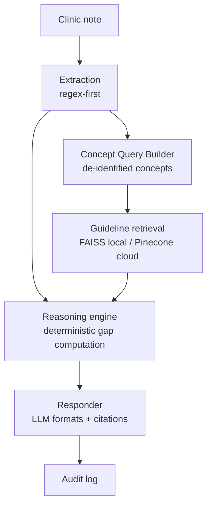
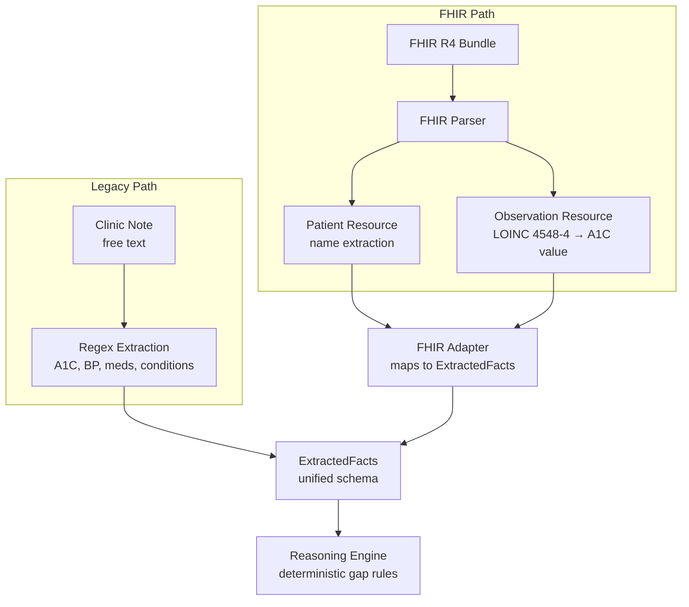
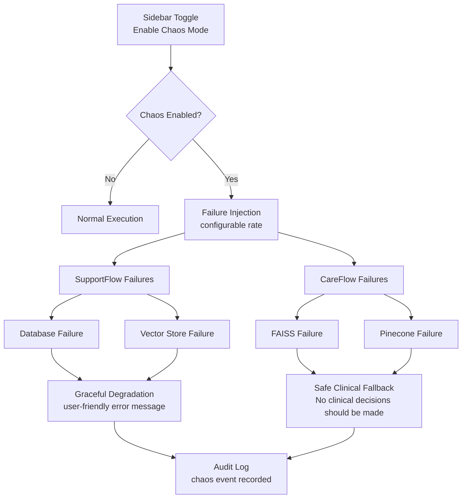
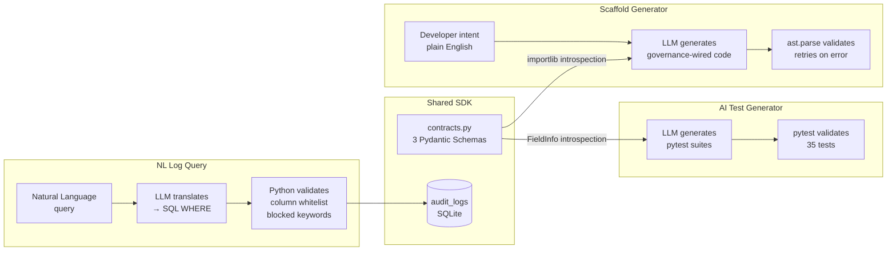

# IntelliFlow OS — Architecture

## Platform Shape

## SupportFlow Flow

## CareFlow Flow (Governed Deterministic Reasoning)

## FHIR Dual-Mode Ingestion

## Chaos Mode Control Flow

## Developer Tools Layer

## Notes
- This is a reference implementation optimized for auditability and interview-ready proof.
- Deterministic logic is used where correctness matters.
- LLM translates and formats; code decides.
