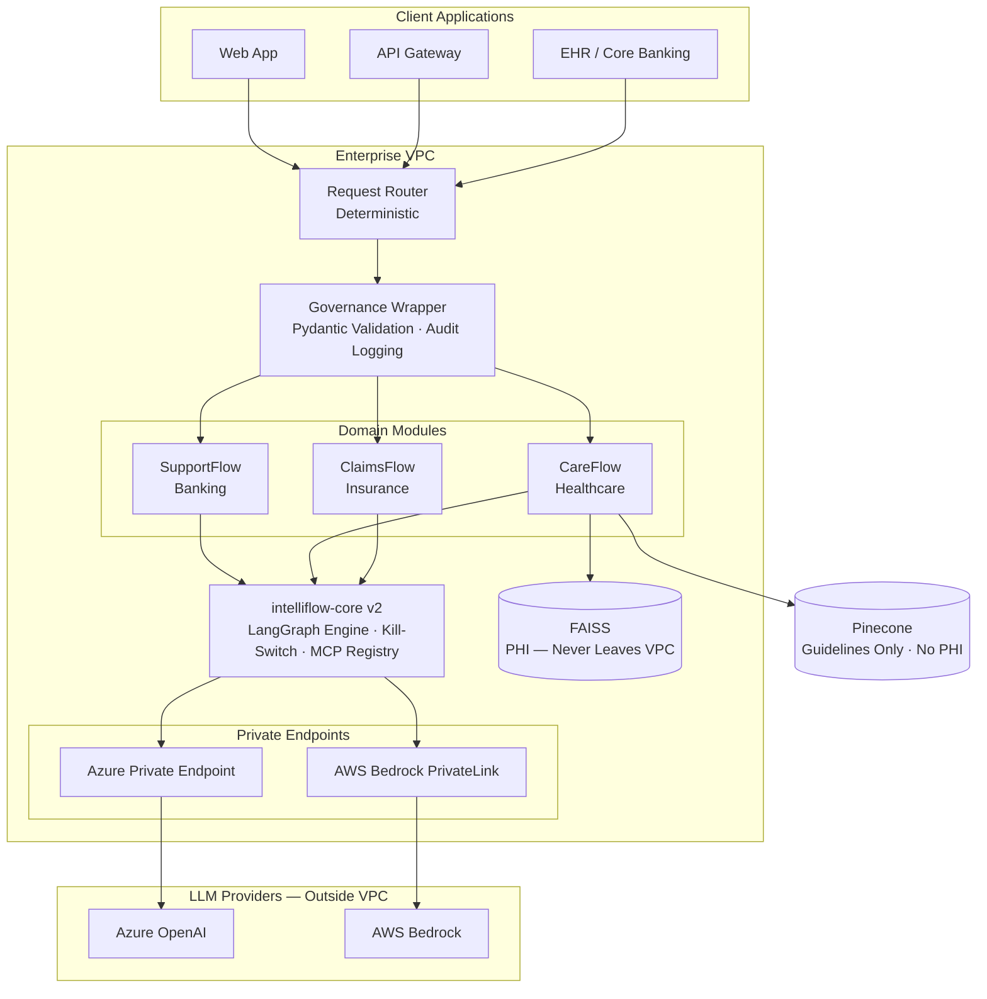
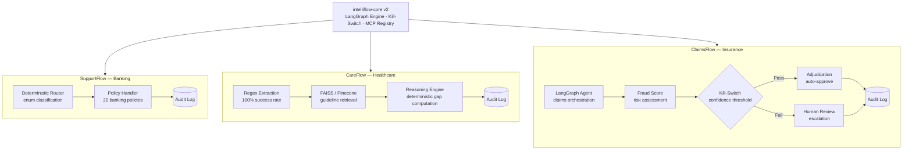
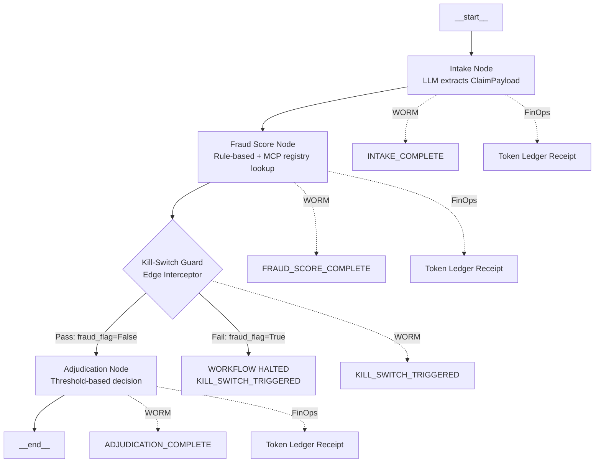
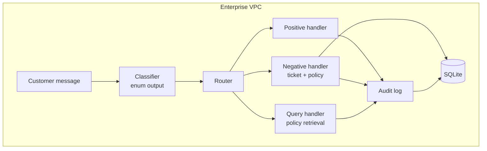
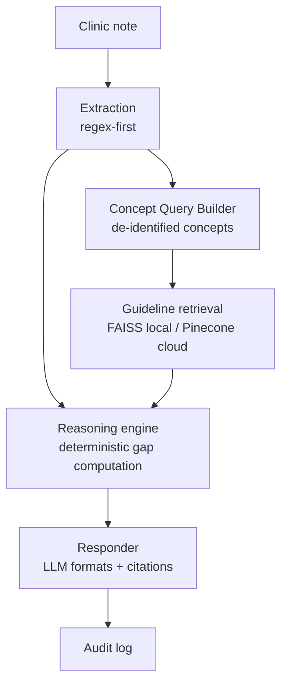
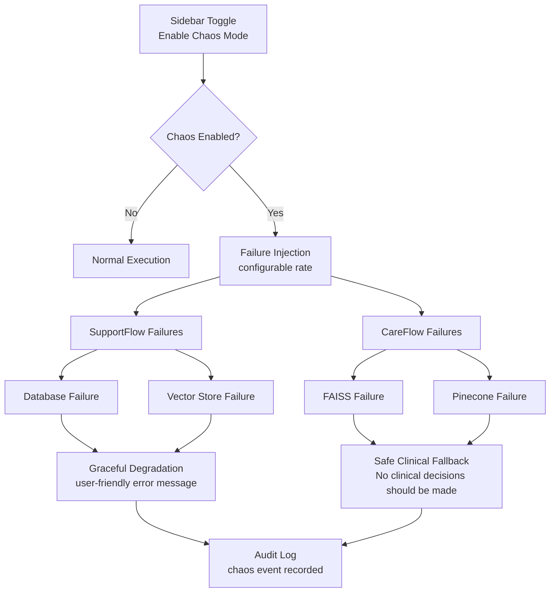
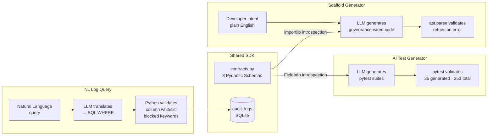
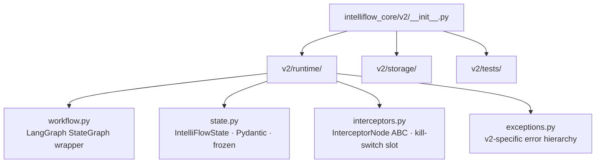

# IntelliFlow OS — Architecture

## Platform Overview

## Module Flow

## ClaimsFlow Flow (LangGraph Agentic Workflow)

The Kill-Switch Guard is wired as a regular LangGraph node (not via `add_interceptor_slot`) — a typed wrapper function ensures LangGraph passes `ClaimsFlowState` (with custom fields) rather than the base `IntelliFlowState`. This architectural choice prevents LangGraph state reconstruction from stripping domain-specific fields (`fraud_score`, `fraud_flag`, `claim_data`).

## SupportFlow Flow

## CareFlow Flow (Governed Deterministic Reasoning)

## Chaos Mode Control Flow

## Developer Tools Layer

## intelliflow-core v2 — Governed Agentic Runtime

### Strangler Fig Migration

v2 lives at `intelliflow_core/v2/` inside the existing intelliflow-core repo. v1 modules (`contracts.py`, `helpers.py`, `governance_ui.py`) remain 100% unchanged. Both generations coexist — v1 consumers are completely unaffected by v2's presence. New agentic workflows use v2; existing deterministic modules stay on v1.

### v2 Package Structure

### Python Version Boundary

v2 requires Python ≥3.10 (LangGraph dependency). v1 continues to support Python ≥3.9. An explicit version guard in `v2/__init__.py` raises `RuntimeError` if imported on Python <3.10. This is environmental defense by architecture — v1 consumers on 3.9 are completely isolated from v2's runtime requirements.

### v2 Runtime Dependency

LangGraph 1.0.9 is the v2 runtime framework. It is **not** listed in `pyproject.toml` — Strangler Fig isolation means v1 consumers never encounter it. v2 consumers install separately: `pip install "langgraph>=0.2.0"`.

### KillSwitchGuard — Governance Enforcement at Graph Level

KillSwitchGuard is a concrete `InterceptorNode` implementation that sits before any LLM-calling node in the LangGraph graph. It evaluates a list of GovernanceRule contracts against the current workflow state. Each GovernanceRule is a dataclass with three fields: `rule_id`, `description` (required — enforces self-documentation), and `logic` (a callable returning bool).

**Behavior:**
- **Fail-closed:** If a rule's logic raises an exception, the rule is treated as failed. The system never silently passes on error.
- **Collect-all-failures:** Every rule is evaluated even after early failures. The complete failure set is included in the KillSwitchTriggered exception for audit.
- **Structured result:** `Workflow.run()` catches KillSwitchTriggered and returns a WorkflowResult with `kill_switch_triggered=True`, `failed_rules`, and `error_message` — no raw exception propagation to callers.

Supporting files: `contracts.py` (GovernanceRule, WorkflowResult), `kill_switch.py` (KillSwitchGuard), `exceptions.py` (KillSwitchTriggered). 8 tests in `test_kill_switch.py`.

### WORM Audit Layer (v2)

DatabaseSessionManager provides a shared SQLite connection with WAL journaling. WORMLogRepository sits below the Workflow engine — it receives `log_event()` calls at WORKFLOW_START, WORKFLOW_END, and KILL_SWITCH_TRIGGERED checkpoints. Each entry is HMAC-SHA256 chained (`prev_hash` -> `entry_hash`). SQLite triggers enforce physical Write-Once at the DB layer. `trace_id` (UUID4 in IntelliFlowState) is the correlation key across all events in a single workflow execution. If any WORM write fails, `WORMStorageError` halts the workflow (fail-closed). `verify_chain()` recomputes all hashes sequentially to detect tampering. Supporting files: `storage/db.py` (DatabaseSessionManager), `storage/worm_logger.py` (WORMLogRepository), `exceptions.py` (+WORMStorageError). 12 tests in `test_worm_logger.py`.

### Token FinOps Tracker (v2)

TokenLedgerRepository provides append-only financial telemetry for LLM token consumption. It shares DatabaseSessionManager with WORMLogRepository for unified SQLite storage. Cost is calculated at write time using static Azure OpenAI pricing (immutable receipt pattern — stored cost_usd is never recalculated). The token_ledger table is append-only financial telemetry. In production deployments, a Data Lifecycle Management (DLM) policy (e.g., 90-day archival to cold storage) is required to prevent unbounded disk growth. See [ADR: Data Lifecycle Management](docs/enterprise/ADR_DATA_LIFECYCLE_MANAGEMENT.md) for the architecture decision rationale and deployer responsibility model. 13 tests in `test_token_ledger.py`.

## Notes
- Enterprise integration middleware optimized for auditability and regulatory compliance.
- Deterministic logic is used where correctness matters.
- LLM translates and formats; code decides.
- Designed for deployment within existing sovereign Azure/AWS perimeters — inherits enterprise identity, encryption, and network controls.
