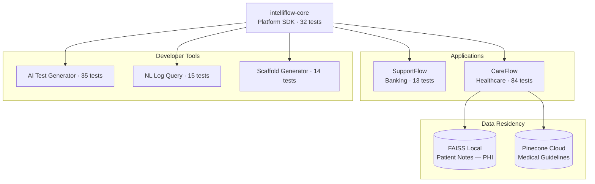

# IntelliFlow OS

**Governance-first AI platform for regulated industries**

A modular AI platform demonstrating enterprise patterns: audit trails, policy-grounded responses, deterministic reasoning, and PHI-aware data residency.

---

## Platform Architecture



> For detailed architecture diagrams (FHIR ingestion, Chaos Mode, Developer Tools flow), see [ARCHITECTURE.md](ARCHITECTURE.md).

---

## Validation

> "Built by someone who understands the brutal reality of deploying software in a regulated enterprise... mature, practical architecture for handling risk in production AI."
>
> — **Saad Subhan**, Software Developer | Tech Lead at a Top 10 US Bank

---

## Demo Videos

| Module | Description | Demo |
|--------|-------------|------|
| SupportFlow | Multi-agent routing, policy citations, chaos mode | [Watch Demo](https://youtu.be/7B6mBKlNL5k) |
| CareFlow | Regex-first extraction, deterministic reasoning, PHI-aware | [Watch Demo](https://youtu.be/Ct9z91649kg) |

---

## Module Overview

| Module | Domain | Key Feature | Tests | Repo |
|--------|--------|-------------|-------|------|
| [intelliflow-core](https://github.com/kmufti7/intelliflow-core) | Platform | Shared governance UI, contracts, helpers | 32 | [View](https://github.com/kmufti7/intelliflow-core) |
| [SupportFlow](https://github.com/kmufti7/intelliflow-supportflow) | Banking | Policy-grounded responses, chaos mode | 13 | [View](https://github.com/kmufti7/intelliflow-supportflow) |
| [CareFlow](https://github.com/kmufti7/intelliflow-careflow) | Healthcare | Deterministic reasoning, PHI-aware vector, FHIR, chaos | 84 | [View](https://github.com/kmufti7/intelliflow-careflow) |
| AI Test Generator | Platform | Schema-aware Pydantic test generation | 35 | This repo |
| NL Log Query | Platform | Natural language audit log search, SQL injection prevention | 15 | This repo |
| Scaffold Generator | Platform | LLM generates platform-compliant code, ast.parse() validates | 14 | This repo |
| **Total** | | | **193** | **158 hand-written + 35 AI-generated** |

---

## Platform Patterns

### Shared Core Imports
Both applications install `intelliflow-core` as a real pip dependency:
```python
from intelliflow_core import add_governance_log, render_governance_panel
```

### What the Core Provides
| Component | Purpose |
|-----------|---------|
| `GovernanceUI` | Streamlit sidebar with real-time audit trail |
| `AuditEventSchema` | Pydantic model for structured event logging |
| `CostTrackingSchema` | Token counting and cost attribution |
| `Helpers` | Event ID generation, timestamps, cost calculation |

### Shared Disciplines
- **Audit logging** — Every decision recorded with timestamp and context
- **Cost tracking** — Per-interaction token usage and cost attribution
- **Deterministic failure injection** — Chaos mode for resilience testing
- **Test discipline** — Regression suite runs before any deployment
- **CI/CD** — GitHub Actions on every push

---

## Developer Tools

IntelliFlow OS includes three developer utilities that demonstrate governed AI-assisted workflows.

### AI Test Generator (Story J)
Generates pytest test cases from natural language descriptions. Uses Claude to produce test code, then validates syntax with ast.parse() before writing files. Pattern: **"LLM generates, ast.parse() validates"** — ensures generated code is syntactically valid before execution.

### NL Log Query (Story K)
Translates natural language questions into SQL queries against audit logs. Prevents SQL injection through parameterized queries and query validation. Pattern: **"LLM translates, Python validates"** — LLM produces the query structure, Python enforces security constraints.

### Scaffold Generator (Story L)
Creates boilerplate module structures from high-level descriptions. Generates directory trees, __init__.py files, and starter code. Validates all generated Python with ast.parse(). Pattern: **"LLM generates, ast.parse() validates"** — same validation pattern as test generator, applied to production scaffolding.

All three tools follow the platform's core principle: **deterministic validation of LLM outputs**.

---

## PHI-Aware Data Residency

CareFlow demonstrates compliance-informed design for healthcare AI:

| Data Type | Storage | Rationale |
|-----------|---------|-----------|
| Patient Notes (PHI) | FAISS (local) | Never leaves the machine |
| Medical Guidelines | Pinecone (cloud) | Public data, scalable retrieval |

### How It Works
1. **Concept Query Builder** extracts generic clinical keywords from patient facts
2. Only de-identified concepts (`"diabetes a1c hypertension"`) go to Pinecone
3. Patient identifiers, specific values, and dates never leave local

### Running Modes
```bash
# Local mode (default) - FAISS only, zero external dependencies
python care_app.py --mode=local

# Enterprise mode - Pinecone for guidelines, FAISS for patient data
python care_app.py --mode=enterprise
```

---

## Key Architecture Decisions

| Decision | Rationale |
|----------|-----------|
| LLM extracts, code decides | Deterministic gap computation (no hallucination) |
| Regex before LLM | Cost optimization (100% regex success on test patients) |
| Keyword matching in SupportFlow | Proves pattern; swap for vector search in production |
| Separate FAISS indexes in CareFlow | PHI vs non-PHI data separation |
| Shared core library | Real platform architecture, not copy-paste |
| Explicit mode flags | `--mode=local` vs `--mode=enterprise` (not runtime detection) |

---

## Build Metrics

| Metric | Value |
|--------|-------|
| Total tests | 193 (158 hand-written + 35 AI-generated) |
| Test coverage | Extraction, reasoning, routing, chaos, PHI safety, FHIR, schema validation |

---

## Tech Stack

| Component | Technology |
|-----------|------------|
| UI | Streamlit |
| LLM | Azure OpenAI GPT-4o-mini |
| Vector DB (local) | FAISS |
| Vector DB (cloud) | Pinecone |
| Embeddings | text-embedding-3-small |
| Database | SQLite |
| Platform Core | intelliflow-core (pip) |
| Validation | Pydantic v2 |
| Testing | pytest + GitHub Actions |

---

## Quick Start

### Clone All Repos
```bash
# Platform core
git clone https://github.com/kmufti7/intelliflow-core.git

# Banking module
git clone https://github.com/kmufti7/intelliflow-supportflow.git

# Healthcare module
git clone https://github.com/kmufti7/intelliflow-careflow.git
```

### Run SupportFlow (Banking)
```bash
cd intelliflow-supportflow/intelliflow_supportflow
pip install -r requirements.txt
cp .env.example .env  # Add OPENAI_API_KEY
python test_suite.py  # 13/13 tests
streamlit run app.py
```

### Run CareFlow (Healthcare)
```bash
cd intelliflow-careflow
pip install -r requirements.txt
cp .env.example .env  # Add OPENAI_API_KEY
python test_suite.py  # 84/84 tests
streamlit run care_app.py
```

---

## Repositories

| Repo | Description | Link |
|------|-------------|------|
| intelliflow-core | Platform SDK | [github.com/kmufti7/intelliflow-core](https://github.com/kmufti7/intelliflow-core) |
| intelliflow-supportflow | Banking AI Assistant | [github.com/kmufti7/intelliflow-supportflow](https://github.com/kmufti7/intelliflow-supportflow) |
| intelliflow-careflow | Healthcare AI Assistant | [github.com/kmufti7/intelliflow-careflow](https://github.com/kmufti7/intelliflow-careflow) |

---

## Disclaimer

This is a **portfolio reference implementation** demonstrating governance-first AI patterns with synthetic data.

- **Not a certified medical device**
- **Not a production HIPAA-compliant system**
- **Demonstrates compliance-informed design patterns for regulated industries**

---

## Author

**Kamil Mufti** — Senior AI Product Manager

- GitHub: [github.com/kmufti7](https://github.com/kmufti7)
- LinkedIn: [linkedin.com/in/kamilmufti](https://linkedin.com/in/kamilmufti)
